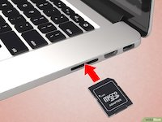
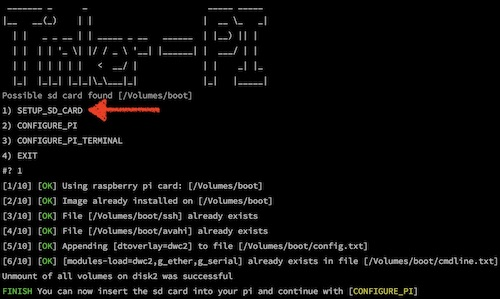
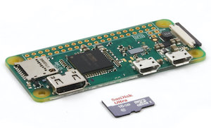
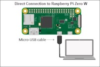
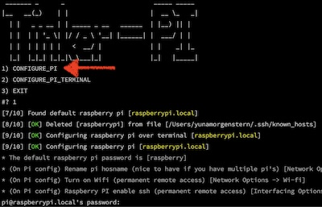
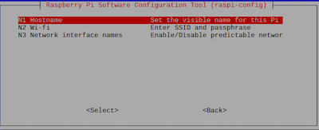
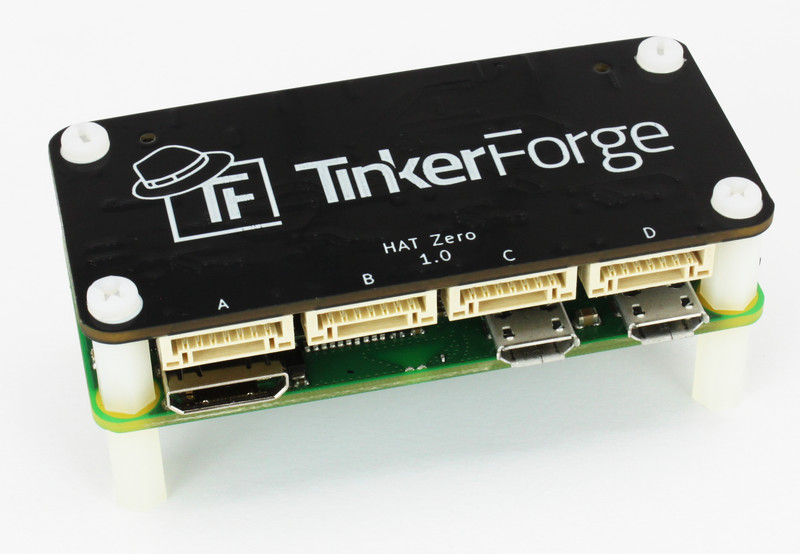

```shell script
 _______ _      _                        _____ _____  
|__   __(_)    | |                      |  __ \_   _|
  | |   _ _ __ | | _____ _ __   ______  | |__) || |  
  | |  | | '_ \| |/ / _ \ '__| |______| |  ___/ | |   
  | |  | | | | |   <  __/ |             | |    _| |_  
  |_|  |_|_| |_|_|\_\___|_|             |_|   |_____| 
```
#### Setup Raspberry Pi Zero over USB (UART SSH) - UNIX ONLY

[![Issues][issues_shield]][issues_link]
[![Commit][commit_shield]][commit_link]
[![License][license_shield]][license_link]
[![Tag][tag_shield]][tag_link]
[![Size][size_shield]][size_shield]
![Label][label_shield]

[issues_shield]: https://img.shields.io/github/issues/YunaBraska/tinker-pi?style=flat-square
[issues_link]: https://github.com/YunaBraska/tinker-pi/commits/master
[commit_shield]: https://img.shields.io/github/last-commit/YunaBraska/tinker-pi?style=flat-square
[commit_link]: https://github.com/YunaBraska/tinker-pi/issues
[license_shield]: https://img.shields.io/github/license/YunaBraska/tinker-pi?style=flat-square
[license_link]: https://github.com/YunaBraska/tinker-pi/blob/master/LICENSE
[tag_shield]: https://img.shields.io/github/v/tag/YunaBraska/tinker-pi?style=flat-square
[tag_link]: https://github.com/YunaBraska/tinker-pi/releases
[size_shield]: https://img.shields.io/github/repo-size/YunaBraska/tinker-pi?style=flat-square
[label_shield]: https://img.shields.io/badge/Yuna-QueenInside-blueviolet?style=flat-square
[gitter_shield]: https://img.shields.io/gitter/room/YunaBraska/nats-streaming-server-embedded?style=flat-square
[gitter_link]: https://gitter.im/nats-streaming-server-embedded/Lobby

## Motivation
Since i am using the PI Zero for many projects, i needed a a way to setup a pi without any keyboard or monitor connected

## How to use it
This script will install (only if no image is already installed) `Raspian lite` image which can be changed in the script by changing the `PI_IMAGE_URL` variable
1) Download the script `tinkerPi.sh`
2) Insert an empty or pi micro SD-Card in your computer



3) Open the terminal
4) Start the script like this `sodo /pat-to-the-downloaded-script-folder/tinkerPi.sh`
5) Select `SETUP_SD_CARD` from the menu and follow the setup

 

6) Insert the micro SD-Card now to the raspberry pi zero



7) Connect the Pi with your computer using a micro USB wire (On PI, use the micro usb slot which is the closest to the center)

 

8) Select not the menu item `CONFIGURE_PI` from the `tinkerPI.sh` script and follow the instructions





9) Done

### Interesting tools:
* [SparkFun-Pi-Zero-USB-Stem](https://www.amazon.de/SparkFun-Pi-Zero-USB-Stem/dp/B079H4CWTL)

* [hat-zero-brick](https://www.tinkerforge.com/en/shop/bricks/hat-zero-brick.html)

* [Java Tinkerforge-Sensor library](https://github.com/YunaBraska/tinkerforge-sensor)