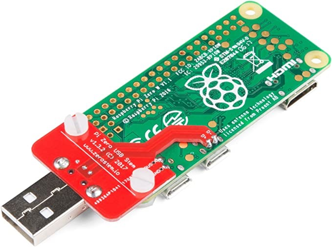

```shell script
 _______ _      _                        _____ _____  
|__   __(_)    | |                      |  __ \_   _|
  | |   _ _ __ | | _____ _ __   ______  | |__) || |  
  | |  | | '_ \| |/ / _ \ '__| |______| |  ___/ | |   
  | |  | | | | |   <  __/ |             | |    _| |_  
  |_|  |_|_| |_|_|\_\___|_|             |_|   |_____| 
```
#### Setup Raspberry Pi Zero over USB (UART SSH) - UNIX ONLY

## Motivation
Since i am using the PI Zero for many projects, i wanted to have a way for setting it up without any keyboard or monitor connected

## How to use it
1) Download the script `tinkerPi.sh`
2) Insert an empty or pi micro SD-Card in your computer

3) Open the terminal
4) Start the script like this `sodo /pat-to-the-downloaded-script-folder/tinkerPi.sh`
5) Select `SETUP_SD_CARD` from the menu and follow the setup
 
6) Insert the micro SD-Card now to the raspberry pi zero

7) Connect the Pi with your computer using a micro USB wire (On PI, use the micro usb slot which is the closest to the center)
 
8) Select not the menu item `CONFIGURE_PI` from the `tinkerPI.sh` script and follow the instructions


9) Done

### Interesting tools:
* [SparkFun-Pi-Zero-USB-Stem](https://www.amazon.de/SparkFun-Pi-Zero-USB-Stem/dp/B079H4CWTL)

* [hat-zero-brick](https://www.tinkerforge.com/en/shop/bricks/hat-zero-brick.html)

* [Java Tinkerforge-Sensor library](https://github.com/YunaBraska/tinkerforge-sensor)